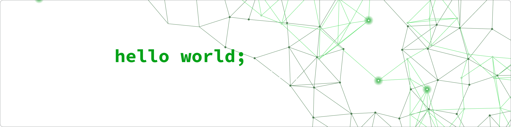

<!--Banner-->

<!--Night Owl image-->

  

<!--Header Name-->
#  ɪ'ᴍ THABO!
*Full-stack Software Developer*
 

<!--Start Intro-->

I'm a passionate full-stack developer with experience building practical, secure, and user-friendly web and mobile solutions. I enjoy working on real-world systems, especially projects involving clean interfaces, scalable back ends, and thoughtful product workflows.

🌱 Currently expanding my knowledge in modern web architectures and cloud technologies

🎨 Building intuitive interfaces with a focus on accessibility and user experience

💡 Interested in solving complex problems through clean, maintainable code

🔐 Experienced with role-based access control, multi-tenancy, payment gateways, and dynamic custom forms

💼 Check out my Portfolio to see the projects I've worked on
<!--End Intro-->

---

<!--Languages and Tools Section-->
<h2 align="center">Tᴇᴄʜ sᴛᴀᴄᴋ</h2>

| Category | Skills |
|----------|--------|
| 🎨 **Front End** |      |
| ⚙️ **Back End** |      |
| 🗄️ **Databases** |    |
| 💻 **Languages** |      |
| ☁️ **Cloud & DevOps** |     |
| 🔧 **Tools** |        |
| 🚀 **Project Experience** |      |

---

<!--STARTS_HERE_QUOTE_CARD-->
<!--

  

-->
<!--ENDS_HERE_QUOTE_CARD-->

<!--Contact Section-->
<h2 align="center">🤝 Cᴏɴɴᴇᴄᴛ Wɪᴛʜ Mᴇ 🤝</h2>

  

  

