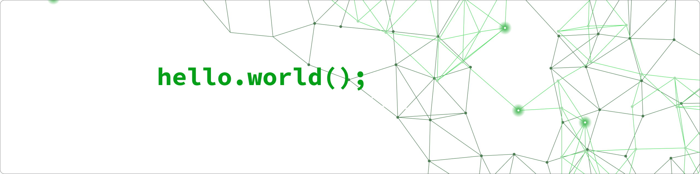

<!--Banner-->

<!--Night Owl image-->

  

<!--Header Name-->
#  ɪ'ᴠTHABO! 
*Full-stack Software Developer*
  

<!--Start Intro-->

I'm a passionate web and app developer with a focus on creating practical and efficient solutions. I enjoy working on exciting projects and continuously growing my skill set.

- 🌱 Constantly learning and improving my expertise, particularly in the MERN stack, Laravel, and Tailwind CSS.
- 👨‍💻 Proficient in various technologies, including JavaScript, React, Node.js, PHP, and MySQL.
- 🛠 Experienced in full-stack development, from building frontend UIs to setting up backend databases.
- 💼 Check out my [Portfolio](https://thabotshabalala.netlify.app/) to see the projects I’ve worked on.
<!--End Intro-->

---

<!--Languages and Tools Section-->       
<h2 align="center">Tᴇᴄʜ sᴛᴀᴄᴋ</h2> 
<picture>
  <source media="(prefers-color-scheme: dark)" srcset="./Skills_Animation_Dark.gif">
  <source media="(prefers-color-scheme: light)" srcset="./Skills_Animation_White.gif">
  
</picture>
 

<h3 align="left">Front end</h3>
<ul align="left">
  <li>React</li>
  <li>React Native</li>
  <li>NextJS</li>
  <li>Tailwind CSS</li>
  <li>Bootstrap</li>
</ul>
  
<h3 align="left">Back end</h3>
<ul align="left">
  <li>Laravel/PHP</li>
  <li>NodeJS</li>
</ul>

<h3 align="left">Database</h3>
<ul align="left">
  <li>MySQL</li>
  <li>MongoDB</li>
  <li>Firebase</li>
</ul>
 
 
 
 

  

&nbsp;

<!--STARTS_HERE_QUOTE_CARD-->
<!--p align="center">
    
</p-->
<!--ENDS_HERE_QUOTE_CARD-->

<!--Contact Section--> 

<h2 align="center">🤝 Cᴏɴɴᴇᴄᴛ Wɪᴛʜ Mᴇ 🤝 </h2>

  

